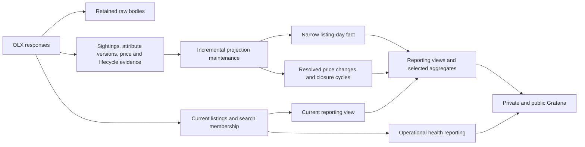

# Database storage, scraper writes, and Grafana assessment

Date: 2026-09-07. Scope: repository review plus read-only inspection of the **local** `olx-db` database. No schema, data, retention, or runtime configuration was changed. The instance was not inspected. This is an assessment and proposed implementation sequence.

Execution companion: [Database storage implementation and agent work guide](DATABASE_STORAGE_IMPLEMENTATION_GUIDE.md), with package ownership, dependencies, acceptance tests, and rollout steps.

## Recommendation

**Yes to a clearer operational/reporting table split within PostgreSQL; no immediate need for another database engine.** The application already has this split in part: `listings` and search membership are current operational state, event tables preserve evidence, and `listing_daily` is a persisted analytical projection. Grafana currently reads all three layers through a mixture of functions, ordinary views, and direct SQL.

The first priority is a confirmed rebuild bookkeeping defect, followed by narrowing the existing daily projection and removing duplicate raw JSON. Simply adding OLAP tables alongside every existing representation would increase storage. Savings require replacing redundant representations or adopting an explicit retention policy.

The local database is about **145 MiB**. `listing_daily` accounts for approximately **67%** of that allocation. This does not justify an engine migration by itself. There is no measured daily physical growth rate yet; the figures below are a snapshot, not a capacity trend.

**Owner clarification:** the observed growth is the compressed sync dump, from roughly 300,000 bytes previously to 9 MB or more now. Required retention is **three days of raw responses**, with **normalized article history retained back to publication**. These are the requirements for the proposed implementation; this documentation-only review has not changed the running 30-day default.

This changes the interpretation of growth: a logical `pg_dump -Fc` contains data and object definitions, not copies of physical index pages or dead tuple/free-space allocation. Rebuild churn remains a real operational defect, but it does not directly explain a 30-fold compressed archive increase if logical contents are unchanged. **Follow-up compressed exports identify raw responses as the largest measured transfer contributor: 5.88 MB versus 0.90 MB for daily inventory.** The original 300 KB archive was not available among the inspected local files, so the exact historical change cannot be reconstructed. [PostgreSQL pg_dump documentation](https://www.postgresql.org/docs/16/app-pgdump.html).

## Measured local baseline

Read-only SQL was run on 2026-09-07 around 19:35 UTC against PostgreSQL 16.15. Database allocation was 152,493,079 bytes. PostgreSQL's displayed MB values below use binary units and are rounded. Table totals include indexes and TOAST; they exclude cluster WAL, backups, Grafana's own volume, and Docker disk overhead.

| Relation | Rows | Total allocation | Table including TOAST | Indexes |
| --- | ---: | ---: | ---: | ---: |
| `listing_daily` | 88,439 exact | 98 MiB | 67 MiB | 30 MiB |
| `raw_api_responses` | 906 exact | 14 MiB | 14 MiB | 144 KiB |
| `listing_state_history` | 22,266 exact | 14 MiB | 11 MiB | 2,352 KiB |
| `listing_price_events` | 11,709 exact | 4,584 KiB | 1,992 KiB | 2,592 KiB |
| `listings` | ~1,748, statistics estimate | 3,784 KiB | 2,576 KiB | 1,208 KiB |
| `price_history` | 1,796 exact | 288 KiB | 144 KiB | 144 KiB |
| Other relations | Small individually | Each below 1 MiB | — | — |

Important observations:

- Daily rows span 2020-11-09 through 2026-09-06. The most recent day has 1,623 rows. Source-history price assertions reach back to 2020, allowing inferred inventory before direct tracking began; these are not six years of direct scrape observations.
- Daily JSON has **1,631 distinct `filter_attributes` values across 88,439 rows**. Summing `pg_column_size(filter_attributes)` gives 20,695,233 bytes across rows, versus 763,533 bytes when grouped by distinct JSON value. These are value-size measurements, not guaranteed reclaimable disk bytes: compression, page occupancy, dictionary keys, and indexes affect the actual saving.
- All 88,439 daily rows have equal `location` and `neighborhood` values. The bulk rebuild deliberately writes the same resolved value to both columns.
- There are 327 search archives and 579 detail archives; **375 detail archives have identical `payload` and `source_payload`**. None of the 906 raw rows is expired. Their fetch dates cover September 5–6 only, so the local sample does not demonstrate a 30-day retention plateau.
- Of 9,768 current search/detail price observations, 7,526 have the same price and price state as the preceding current observation for that article, ordered by effective time and ID. This approximately 77% repetition is a compression opportunity, not permission to delete those observations: this comparison excludes imported assertions and does not account for every semantic boundary.
- `listing_daily` has six indexes including its primary key. The largest is `listing_daily_day_filter_idx`, at approximately 11 MiB. Zero scan counts on some indexes are insufficient grounds for removal; the statistics window and representative workload have not been established.
- Statistics reported zero dead tuples in the four major history/archive relations, with recent autovacuum activity on the analytical/history tables. That does **not** establish zero bloat: dead-tuple estimates do not measure all reusable space or index fragmentation. The legacy table's statistics estimate was only 96 rows versus 1,796 from `count(*)`, illustrating why estimates must be labeled.
- Local sync archives grew from 6,991,541 to 7,857,683 to 8,753,898 bytes across three September 6 runs. Compressed dump sizes are not physical database sizes and these same-day runs are not a normal daily growth benchmark.

After the owner's clarification, individual `pg_dump -Fc --data-only -t public.<table>` outputs were streamed directly to a byte counter, without saving files or changing data:

| Table | Compressed data-only export bytes |
| --- | ---: |
| `raw_api_responses` | 5,882,578 |
| `listing_state_history` | 1,240,542 |
| `listing_daily` | 901,617 |
| `listings` | 257,619 |
| `listing_price_events` | 194,363 |
| `price_history` | 21,815 |

Each export includes its own small archive overhead; these are sequential per-table measurements, not byte-exact offsets within the earlier full sync archive. Nevertheless, raw bodies clearly dominate these measured compressed contributions. Daily snapshots compress well because of repetition. **For the user's sync-size concern, prioritize raw retention/body deduplication; for physical database allocation, prioritize the daily projection; for wasted maintenance work, prioritize the chunk bug.** Removing duplicate JSON does not necessarily halve compressed archive bytes because compression already exploits some repetition.

## Database setup and deployment

[docker-compose.yml](../../docker-compose.yml) provisions PostgreSQL 16, a scraper, an explicit migrator, a standalone maintenance job, Grafana, and a backup sidecar. The database container has a 768 MiB memory limit, 0.5 CPU, 192 MiB shared buffers, 8 MiB `work_mem`, and 40 maximum connections. Query fan-out and repeated rebuilding deserve attention on this budget even while storage is small.

Schema initialization is split across [db/init](../../db/init): tables, indexes, geography, helpers, views, filters, reconstruction, triggers, and the public reporting contract. The migrator applies the current schema to existing installations. `schema_migrations` is migration bookkeeping; `neighborhoods` stores geographic lookup data.

[Database roles](../../db/init/zz-database-roles.sh):

- `olx_app` owns application objects and is used for scraper writes, migrations, and restores.
- `olx_reader` has broad `pg_read_all_data` access, and is shared by private Grafana and backups. It also receives execution privileges on application functions. Its privileges are broader than a dedicated reporting API.
- `olx_public_reader` has an explicit SELECT allowlist on five `dashboard_public` views, a read-only transaction default, and a 15-second statement timeout. It cannot directly read raw evidence or operational tables.

The private datasource allows 20 connections and the public datasource 10. Both consume the same database's resources; separate roles or schemas provide access boundaries, not CPU/I/O isolation.

The deployment already separates machines: [sync-to-instance.ps1](../../scripts/sync-to-instance.ps1) scrapes locally, makes a **whole-database** custom-format dump, streams it to the instance, and invokes [remote-restore.sh](../../db/remote-restore.sh). Thus the reporting host receives raw archives and operational state along with analytical data. This is a snapshot-copy architecture, not streaming replication or incremental ETL. A schema split alone will not reduce this transfer.

The backup sidecar creates full logical dumps and retains them for 14 days by default. Successful sync runs retain the newest three local sync dumps; failed sync attempts bypass that pruning branch. Backup cleanup separately matches `olx-*.dump` by age. Manual files with different names may persist. Distinguish database relation growth from these additional copies, restore working space, WAL, and Docker's virtual disk high-water mark.

## How the scraper writes

### Search ingestion

[harvest.js](../../scraper/src/search/harvest.js) archives each received search page and records page manifests before authoritative domain ingestion. The archive contains an adapter representation (`items`, metadata, limits) plus the decoded original upstream JSON when available. Failed or incomplete attempts can therefore leave valid diagnostic/archive records without changing market state.

After a complete validated harvest, [scraper.js](../../scraper/src/scraper.js) passes cards, state observations, and price observations to [commitSearchIngestion](../../scraper/src/db/ingestion.js). Within one transaction and a lifecycle advisory lock, ingestion:

1. Inserts new `listings` and updates current fields on existing listings. Every sighting updates `last_seen`, even when the advertised price is unchanged.
2. Appends a `listing_state_history` search observation per card, including price, size, rooms, category, search key, and JSON attributes. JSON includes title, URL, search attributes, and other evidence.
3. Records canonical `listing_price_events` through [price-history.js](../../scraper/src/price-history.js).
4. Reconciles `search_results`, a many-to-many current search/listing membership table. Overlapping searches do not duplicate the `listings` primary-key row, but can produce separate observations of the same article.
5. Records reopen/closure events and freezes current closing fields when the article disappears from all retained memberships.
6. Marks analytical dates dirty, updates `saved_searches` counters, and finishes the scrape run.

Deduplication in `listing_price_events` uses `(article_id, effective_at, price, price_state)`, with NULLs treated as equal. It suppresses identical assertions at the same time, including across sources; **it does not suppress the same price seen at a later time**. Same-time competing assertions can produce a conflict marker. Observation time and renewal time have deliberately different meanings.

`scrape_runs` and `scrape_run_pages` accumulate run/page telemetry. They have no routine age-based deletion in the inspected code. `saved_searches` is current metadata/counters, not a daily summary history.

### Detail enrichment and lifecycle

[enrichment.js](../../scraper/src/db/enrichment.js) archives successful detail bodies, then updates the listing, appends a detail state observation, and records both current price evidence and source-provided historical prices. The successful archive writer explicitly supplies the same JSON as both payload columns. Archive writes precede the domain transaction, so a later rollback can retain the fetched evidence.

The current listing contains both typed attributes and `characteristics` JSON. Some values use first-non-null semantics, others are merged or updated. `api_price_history` uses `COALESCE(existing, incoming)`; it is not simply a continually replaced latest price log, although incoming history assertions are still normalized into events.

`detail_jobs` is one durable queue row per listing with leases, retry timing, and completion state. Its row count follows listings queued, not every attempt. [lifecycle.js](../../scraper/src/db/lifecycle.js) also handles closure reconciliation and records lifecycle evidence.

`price_history` is a legacy import source. No normal production writer was found for it in the inspected scraper path; [price-history-backfill.js](../../scraper/src/price-history-backfill.js) still reads it and `listings.api_price_history`. Removing it requires verifying conversion coverage and updating that compatibility path. At 288 KiB it is not a priority storage fix.

### Daily reconstruction and retention

[maintenance.js](../../scraper/src/db/maintenance.js) chooses a dirty/missing date range and calls [rebuild_listing_daily](../../db/init/06-rebuild.sql), normally in at most 31-day transactions. This is a regular stored table populated by application maintenance, not a PostgreSQL materialized view.

Reconstruction deletes the chosen daily range and reinserts one row per eligible article/day. It considers all evidence-bearing articles against the requested day grid, resolves price and sparse historical attributes, carries membership information forward, calculates geography and price per square metre, and persists inference, staleness, and provisional-day flags. The grid's computation can exceed the number of rows ultimately retained.

The activity horizon is 14 days for observed inventory; explicit closure ends eligibility, while earlier source-price evidence can support inferred pre-observation days. Daily boundaries use `Europe/Sarajevo`; historical endpoints are half-open midnight boundaries and the current day is provisional. `analytics_daily_coverage` records even empty rebuilt days, while `analytics_refresh_state` tracks dirty ranges and completion.

Repeated rebuilding should replace logical rows rather than append duplicates because of `(day, article_id)`. It still creates deleted row versions, index maintenance, and WAL. Normal vacuum generally makes this space reusable rather than shrinking files back to their original size. `VACUUM FULL` rewrites and exclusively locks a relation and needs additional working space; it is not the first remedy here. [PostgreSQL vacuum documentation](https://www.postgresql.org/docs/16/routine-vacuuming.html).

Raw expiry defaults to 30 days and is assigned when each archive is written. `purgeRawResponses()` deletes expired rows in batches of 1,000. Changing the configuration affects newly written expiry timestamps; it does not reschedule existing rows automatically. No analogous retention is implemented for normalized evidence or daily inventory.

The normal scraper cycle runs rebuild and then purge only if at least one search succeeded. Standalone [maintenance-only.js](../../scraper/src/maintenance-only.js) removes the upstream-success dependency, but still rebuilds **before** purging. A failed rebuild prevents that invocation's purge. Scheduling maintenance alone does not eliminate this coupling.

## Confirmed defect: chunked rebuild does not consume a long dirty range

Local state reported:

| Field | Value |
| --- | --- |
| `pending_from_day` | 2020-11-09 |
| `pending_through_day` | 2026-09-06 |
| `completed_through_day` | 2026-09-05 |
| `last_successful_refresh_at` | 2026-09-06 21:36:49 UTC |
| Next window from `analytics_daily_rebuild_window()` | 2020-11-09 through 2026-09-07, `pending_evidence` |

Both the checked-in SQL and the installed function clear the pending range only when **one call** covers its whole extent:

```sql
v_from <= v_pending_from AND v_through >= v_pending_through
```

Otherwise the function updates the completion watermark but leaves the pending bounds untouched. With a multi-year dirty interval and 31-day chunks, the first chunk reaches the beginning but not the end; the last reaches the end but not the beginning. No chunk clears the range, and no branch advances its beginning. The JavaScript loop does not perform a final acknowledgement either. A subsequent maintenance invocation can rebuild the same historical interval again.

This is a code-supported mechanism and is consistent with the measured pending state. It does not prove what fraction of physical growth came from repeated runs; no historical relation-size series or bloat measurement was collected. It does establish a higher-priority fix than introducing another database.

Proposed repair: consume a successfully rebuilt prefix atomically with its data/coverage write. For a chunk beginning at or before the pending start, advance the pending start past the successfully rebuilt chunk, or clear both bounds if the end was covered. Preserve dirty ranges inserted concurrently, including newly arrived older evidence. The existing refresh-state row lock helps serialize updates; include transaction-isolation and interleaving tests. Do not blindly clear the entire range after the JavaScript loop, and do not remove a valid dirty marker merely because coverage rows already exist.

## What Grafana reads and how

[Datasource provisioning](../../grafana/provisioning/datasources/postgres.yml) uses Grafana's server-side PostgreSQL proxy to `db:5432`. Dashboard JSON contains SQL; variables and time macros are interpolated into queries, and PostgreSQL executes the aggregations. There is no scraper HTTP API serving dashboard data. Multiple panels may independently repeat similar work.

| Dashboard | Data and access path |
| --- | --- |
| Private `olx-home` | Current inventory, sale/rent medians and yield from `v_active_listings`; weekly comparisons from `v_listing_daily`; inventory flows from `v_market_daily`; freshness/failures/cards from `scrape_runs`; closure counts from `listings`. |
| Private `olx-overview` | Current cards, maps, characteristics, room/floor/seller/location analyses via `listings_filtered()`; daily quantiles via `market_daily_filtered()`; weekly comparisons via `v_listing_daily`; price drops via `price_changes_filtered()` and `v_listing_price_changes`, sometimes joined to current listings. |
| Private `olx-exits` | Current frozen closure fields via `listings_closed_filtered()`, lifetime measures via `v_listing_lifecycle`, daily asking comparisons via `market_daily_filtered()`, and weekly priced shares via `v_listing_daily`. |
| Private `olx-health` | Direct operational queries over searches, runs, listings, canonical price events, and analytical refresh state. Covers failures, completeness, enrichment coverage, invalid/conflicting prices, and refresh backlog. |
| Public home | `dashboard_public.current_listings`, `price_reductions`, and `freshness`: category/deal summaries, new actives, reductions, and freshness. |
| Public apartment sale/rent | Same constrained current/reduction views; sales also query `dashboard_public.daily_market` for daily asking trends. Includes article links and listing-level results. |
| Public exits | `dashboard_public.exit_cycles` and `freshness`: observed closure cycles, duration, reopening, and closure-time asking prices. |
| Provisioned alerts | Private datasource queries on runs, per-search latest complete success, and analytics refresh backlog/freshness. |

The four private dashboards specify a five-minute refresh. Public JSON does not specify that same refresh setting. Actual execution frequency also depends on viewers and sharing behavior.

The views in [04-views.sql](../../db/init/04-views.sql) and [08-dashboard-public.sql](../../db/init/08-dashboard-public.sql) are **ordinary views**. Five public views do not mean five stored data copies. Their joins, lateral lookups, windows, and aggregates execute against underlying tables. A materialized view instead persists its results and adds storage plus a refresh responsibility. [PostgreSQL materialized-view documentation](https://www.postgresql.org/docs/16/rules-materializedviews.html).

In particular:

- `market_daily_filtered()` computes exact p25/median/p75 from listing-day rows after category, deal, rooms, size, and neighborhood filters. The public `daily_market` view is also listing-day grain, despite its name; it is not a pre-aggregated market summary.
- `v_listing_price_changes` resolves competing same-time assertions, joins historical state, and uses ordered predecessor prices. It excludes unchanged prices and invalid/unpriced/conflict or sale/rent boundaries from valid price-change output.
- Lifecycle views reconstruct first sightings, reopenings, and closures from evidence at query time. Private exit panels and public cycle panels intentionally use different sources/grains; migration parity must compare each to its own existing contract.
- Some historical views join current title/URL or current neighborhood. Public price reductions use current listing neighborhood, whereas private filtered price changes resolve it from event-state JSON. Do not silently unify those semantics as a storage optimization.
- Dropdown SQL itself scans historical categories, rooms, and neighborhoods, sometimes without a date restriction. Small reporting dimension tables could reduce this work.
- Checked-in dashboards do not directly query `raw_api_responses`, legacy `price_history`, or raw `api_price_history`. Health panels still need some operational/evidence access.

## Which duplication is useful and which is avoidable?

| Representation | Assessment | Proposed treatment |
| --- | --- | --- |
| Current `listings` plus historical evidence | Different temporal purposes. Current state cannot recover old price/state or closure cycles. | Keep both purposes; define their contracts explicitly. |
| Full detail JSON twice per raw row | Confirmed exact duplication on the current successful detail path. | Store one canonical body, with compatibility handling for old archive shapes. Replay already prefers `source_payload` then `payload`; inspect all consumers before migration. |
| Search adapter plus original body | Substantial overlapping content, but different formats. | Retain original body and minimal adapter/version metadata if replay can deterministically regenerate the adapter. Preserve old format support during transition. |
| Typed detail fields plus `characteristics` | Useful query-friendly values plus broader evidence, partly overlapping. | Preserve source evidence according to retention; avoid copying all attributes into every reporting day. |
| Every search state repeats title/URL/attributes | Repeated observation metadata is stored as wide snapshots. | Separate narrow sighting evidence from attribute versions after preserving temporal rules. |
| Every unchanged price is a new timestamped event | Repeated value, but distinct evidence of observation. | Retain evidence initially; consider compact price intervals plus observation metadata later. Never collapse valid/null/conflict/deal boundaries indiscriminately. |
| Daily resolved JSON repeated across dates | Measured repetition; broad payload not needed by current daily panels. | Reference immutable resolved attribute versions or expose only required historical dimensions in the daily fact. |
| Daily `location` and `neighborhood` | Measured exact equality for all local rows. | Keep one physical canonical column and provide compatibility aliases in views. |
| Legacy price table and JSON after normalization | Migration compatibility, modest storage. | Remove only after a reconciliation/export and retirement of dependent backfill paths. |
| Multiple indexes | Read benefit traded for bytes and writes; several overlap on day/quality. | Measure representative plans and usage before removing any index. |
| Complete local/instance DBs and backup copies | Operational recovery/publication copies. | A report-only publication could reduce remote bytes, but needs a new explicit restore/sync contract. |

PostgreSQL TOAST can compress or store large individual values out of line, but it is not an application-level dictionary that automatically deduplicates equal JSON across arbitrary rows and columns. Thus repeated resolved JSON remains a design issue even when compressed. [PostgreSQL TOAST documentation](https://www.postgresql.org/docs/16/storage-toast.html).

## Proposed target structure

Keep PostgreSQL and introduce a clearer reporting boundary gradually. The following names describe proposed roles; they are not existing migrations.



### Operational and evidence layer

Keep current listings, search membership, searches, run/page telemetry, and the detail queue. Separate wide, slowly changing attributes from sighting records if the measured benefit survives a prototype. An immutable attribute version can be referenced by many sightings and listing days; do not reference a mutable current attribute row for historical reporting.

Keep normalized price/lifecycle evidence independently recoverable after raw expiry. If price evidence is later compressed, distinguish the price-change timeline from sightings that establish continued observation. Preserve source/effective/ingestion times, unknown and conflict states, reopening, and category/deal changes. Daily-only sightings cannot automatically replace all intraday evidence used for closure-time and price-event state.

### Analytical layer

Retain `(day, article_id)` as the detailed inventory grain for arbitrary size filters, exact percentiles, and overlapping categories. Start by replacing repeated broad JSON with typed historical dimensions and/or an immutable `attribute_version_id`. A hash can locate candidate versions, but compare canonical content as well; do not make hash collision assumptions part of data correctness.

Keep historical deal, rooms, size, category membership, neighborhood, price state, and quality flags. Store only one canonical location representation. Preserve compatibility columns through views while consumers migrate. Any replacement for `v_listing_daily.filter_attributes` must still provide the expected historical value, not today's listing JSON.

Persist resolved price changes and closure cycles only if query profiling shows sufficient benefit. These need invalidation from the earliest affected event and enough preceding context to resolve the first change/cycle in a requested range. Late imported prices and reopened ads can revise historical results.

Add small dimension/freshness summaries and selected fixed-cohort daily aggregates where they reduce repeated work. **Do not replace arbitrary filtered listing-level analytics with medians of subgroup medians.** Exact percentiles are not additive. Multi-category membership also makes naive category count summation double-count articles. Existing weekly calculations may pool listing-days, giving a listing multiple contributions across a week; preserve that weighting unless deliberately changing the metric.

Publication must expose a coherent generation/watermark: maintain yesterday's finalized data, today's provisional status, empty-day coverage, and pending late corrections. Use transactional publication of related facts or versioned generations so users do not see a new summary paired with old detail rows.

### Reporting permissions and hosting

Use an explicit reporting schema for private dashboards too, with an operational health surface where necessary. Decouple the private Grafana role from the backup reader before narrowing grants. Keep the existing public allowlist and disclosure boundaries.

A separate report-only database on the instance could eventually be useful because local scraping already feeds a remote reader host. Its benefit would be smaller publication payloads and less evidence on the instance. It requires exporting current report rows, daily facts, resolved events/cycles, health summaries, dimensions, and freshness as one versioned contract. The present whole-database restore script cannot be treated as that exporter without changes.

Physical replicas copy the source storage rather than eliminating its duplication. A warehouse/columnar engine would introduce a second query/schema/deployment/recovery path; consider it only after measured reporting latency, concurrency, or multi-year storage outgrows the simpler design.

## Growth and retention choices

Daily inventory grows approximately with eligible listing-days, even if prices never change. At an illustrative constant 1,623 rows/day, another year adds about 592,000 rows. The current total daily relation allocation divided by its row count is approximately 1,160 bytes per row; applying that ratio gives roughly 1.8 MiB/day or 655 MiB/year **for this relation alone**. This is a rough allocation extrapolation, not a forecast: existing free space, indexes, historical reconstruction, changing inventory, and a slimmer row format can change it substantially.

State/price observations grow with scrape frequency, overlapping searches, and enrichment volume. Raw retention should eventually bound live archive data around the recent ingest rate times retention days, provided purging runs successfully. Rebuild churn and backups add separate physical costs.

**Required policy: retain normalized history back to article publication, and expire raw responses after three days.** Aggregate-only replacement of older normalized history does not meet this requirement. Deleting listing parents also cascades into historical tables, so an ordinary current-listing cleanup is not a safe history-retention mechanism.

Implement three-day retention consistently in configuration defaults, Compose, examples, and operations documentation. Existing archives need an explicit transition to the new horizon, such as capping their expiry at `fetched_at + interval '3 days'`, followed by the bounded purge. Preserve any intentionally shorter expiry. Make purge independent of successful scraping/rebuilding. With a stable ingest rate, three rather than 30 days yields approximately one tenth of the retained raw volume; it does not yield one tenth of the whole dump. In this local snapshot all archives were younger than three days, so immediate savings would be limited.

Retaining history from publication requires distinguishing **publication time**, **first direct observation**, and **earliest supported price assertion**. The current daily reconstruction begins with state/price evidence, not simply `published_at`; it does not guarantee a row for every day since publication. Preserve source `created_at`/normalized publication evidence durably before raw expiry, import genuine upstream price-history assertions, and represent pre-observation gaps as unknown or explicitly inferred. Do not extend today's asking price backward to publication without evidence, or count inferred publication-to-first-sighting periods as directly observed active inventory. If publication is unavailable or inconsistent with other timestamps, retain the evidence and flag uncertainty instead of substituting `first_seen` silently. Per-article history can span that unknown interval without requiring a wide stored row for every calendar day.

A three-day raw window also makes parser-error triage time-sensitive: schema/parser failures and backlogs should be visible before evidence expires. This assessment assumes the requested three days applies to both successful and diagnostic bodies; any longer failure-only archive would be a separate explicit policy. Raw expiry applies to the live archive table; existing 14-day full backups can still contain older raw bodies until those backups expire. Strict deletion from all retained backups would require a separate backup-content/retention change.

Partitioning by day could simplify future expiry of large raw/daily datasets. It does not compress unchanged rows or remove duplication. PostgreSQL partitioned unique/primary constraints must include the partition key, so partitioning tables with globally referenced IDs requires design work. At the current size, defer this until retention or measured maintenance costs justify it. [PostgreSQL partitioning documentation](https://www.postgresql.org/docs/16/ddl-partitioning.html).

## Implementation sequence and acceptance criteria

1. **Fix chunk consumption and independent cleanup.** Test a dirty interval longer than two chunks: it must clear after completion, the next run must choose only legitimate pending/missing/current days, and a failed chunk must leave its work pending. Test concurrent late evidence and a rebuild failure while raw purge still runs. Preserve provisional/current-day and empty-day coverage behavior. This should precede any storage rewrite.
2. **Establish a daily baseline on both hosts.** Record relation/table/index sizes, expired raw rows, ingestion counts by `ingested_at`, oldest pending day, maintenance duration, backup sizes, and filesystem free space for at least a week. Grouping by `effective_at` measures market history, not when an import increased storage. Investigate WAL and Docker disk separately if relation growth does not explain the user's metric.
3. **Apply three-day raw retention and remove duplicate raw storage.** Include existing expiry timestamps in the migration, with boundary tests. Version the archive contract, migrate exact duplicate bodies conservatively, and verify successful search/detail replay plus malformed/blocked diagnostics. Preserve all supported normalized history independently of raw bodies. Measure both compressed archive size and post-migration allocation on a restored copy; dropping a column alone need not reclaim physical bytes immediately.
4. **Prototype a narrow daily fact on a disposable restored database.** Compare typed-only and attribute-version approaches. Measure complete size including dictionary/index overhead, rebuild elapsed time, buffers/WAL, and representative dashboard latency. Expose compatibility views and shadow-compare old/new outputs before switching readers.
5. **Optimize repeated reporting queries.** Profile exact dashboard SQL with representative date ranges and filters. Add resolved change/cycle tables or small aggregates only where they earn their maintenance/storage cost. Reassess overlapping indexes using plans and a known statistics interval.
6. **Retire legacy evidence representations and redesign publication only after reconciliation.** Check conversion coverage, restore/backfill consumers, and retention requirements. If implementing report-only sync, rehearse remote publication failure, rollback, permissions, and version compatibility.

Validation should build on [integration tests](../../scraper/test/integration), especially daily-state, temporal, price-change, lifecycle, public-dashboard, and rebuild-performance tests, plus the dashboard contract checker. Required parity cases include unchanged sightings, overlapping categories, sparse detail enrichment, missing/invalid/conflicting prices, equal-time precedence, sale/rent switches, closure/reopening cycles, pre-tracking inferred history, DST day boundaries, empty days, and late backfills.

For schema transitions, retain a recoverable backup, publish new objects alongside old contracts, compare them, switch readers, and only then retire old storage. No data deletion is proposed as an immediate action in this assessment.

## Repeatable read-only diagnostics

Run these against each relevant database and retain the timestamped output outside the database if avoiding a new monitoring table. On a larger production dataset, use an appropriate statement timeout; exact counts and JSON grouping can scan whole tables.

```sql
BEGIN READ ONLY;
SET LOCAL statement_timeout = '30s';

SELECT now() AS measured_at,
       current_database(),
       pg_database_size(current_database()) AS database_bytes;

SELECT relname,
       n_live_tup AS estimated_live_rows,
       n_dead_tup AS estimated_dead_rows,
       pg_total_relation_size(relid) AS total_bytes,
       pg_table_size(relid) AS table_and_toast_bytes,
       pg_indexes_size(relid) AS index_bytes,
       last_autovacuum, last_autoanalyze
FROM pg_stat_user_tables
ORDER BY total_bytes DESC;

SELECT request_kind, count(*) AS rows,
       count(*) FILTER (WHERE expires_at <= now()) AS expired,
       count(*) FILTER (WHERE payload = source_payload) AS identical_bodies,
       min(fetched_at), max(fetched_at)
FROM raw_api_responses GROUP BY request_kind;

SELECT * FROM analytics_refresh_state;
SELECT * FROM analytics_daily_rebuild_window();

SELECT indexrelname, pg_relation_size(indexrelid) AS bytes, idx_scan
FROM pg_stat_user_indexes
WHERE relname = 'listing_daily'
ORDER BY bytes DESC;

SELECT count(*) AS rows, min(day), max(day),
       count(DISTINCT filter_attributes) AS distinct_attribute_values,
       sum(pg_column_size(filter_attributes)) AS attribute_value_bytes,
       count(*) FILTER (
         WHERE location IS NOT DISTINCT FROM neighborhood
       ) AS equal_location_columns
FROM listing_daily;

COMMIT;
```

The existing [rebuild profiling script](../../db/diagnostics/profile-daily-rebuild.sql) is useful on a disposable restored database. Do not treat `EXPLAIN ANALYZE` of a mutating rebuild as a harmless read-only production size query.

## Confirmed requirements and remaining design choices

The owner confirmed the growth metric and retention requirements during the assessment:

- Compressed sync payload grew from roughly 300 KB to 9 MB or more; the elapsed period and original archive contents remain unmeasured.
- Normalized history must extend back to publication and remain retained; raw responses should remain for three days.
- Missing pre-observation prices/attributes will be treated as unknown or explicitly inferred, preserving the distinction from direct observations. Publication alone does not establish historical availability or price.
- Report-only instance publication remains optional. Before implementing it, decide whether the instance must retain independent repair/rebuild capability or may depend entirely on republication from the local source.

Prioritize the confirmed rebuild repair, the requested three-day raw policy, and semantics-preserving reduction of redundant storage. Separate OLTP/OLAP responsibilities are useful here; the measured opportunity is to finish and slim the split already present while retaining publication-based normalized history.
