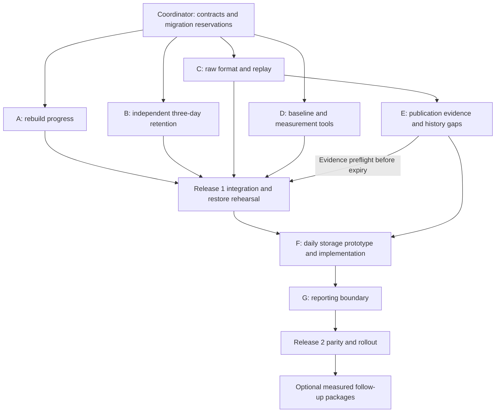

# Database storage implementation and agent work guide

Status: ready for task assignment; implementation has not started under this guide.

Based on [DATABASE_STORAGE_AND_ANALYTICS_ASSESSMENT.md](DATABASE_STORAGE_AND_ANALYTICS_ASSESSMENT.md). The assessment records evidence and current behavior; this guide defines how to change it. Reinspect the checkout before execution because file contents, migrations, and database state may have changed since the assessment.

## 1. Outcome and scope

Deliver two releases within PostgreSQL:

1. **Maintenance and transfer size:** repair chunked analytics progress, run raw cleanup independently of scrape/rebuild success, enforce the owner's three-day live raw retention, and eliminate redundant successful raw bodies while preserving replay compatibility.
2. **Analytical storage and access:** reduce daily fact width through a measured prototype, preserve historical contracts, and give Grafana an explicit reporting surface while keeping operational health queries supported.

The owner requires normalized article history back to publication. Retain supported publication, price, attribute, and lifecycle evidence; represent gaps as unknown or explicitly inferred. Do not invent prices or observed availability between publication and first observation. Retain listing-level history rather than replacing it with aggregate-only history.

The owner's growth metric is the **compressed sync dump**. Measure that separately from physical relation size. The assessment's local sample had 5,882,578 compressed bytes of raw responses, 901,617 of daily data, and a 98 MiB physical daily relation. These figures are reference measurements, not acceptance targets or guarantees of a return to a 300 KB dump.

Not part of the required releases: another database engine, partitioning, price-event compaction, deletion of legacy history, aggregate-only old history, report-only remote sync, or a wholesale redesign of deployment. These remain optional work packages with separate entry criteria below.

This guide authorizes no execution by itself. When assigned implementation work, complete code, migrations, tests, and a reviewable rollout plan within that assignment. Production application and publishing follow the authorization in the active session. Do not launch deployments merely because a task mentions deployment validation.

## 2. Invariants every agent must preserve

| Area | Required behavior |
| --- | --- |
| Price evidence | Preserve effective time, observation time, ingestion time, renewal metadata, source provenance, conflict precedence, and valid/unpriced/invalid/unknown boundaries. |
| Listing history | Publication is distinct from first sighting. Raw expiry must not delete normalized history. A missing publication timestamp stays unknown. |
| Lifecycle | Failed/incomplete searches cannot fabricate closures. Preserve overlapping-search membership and each closure/reopening cycle. |
| Daily inventory | One eligible article per Sarajevo day; retain historical inference/stale flags, current-day provisional status, empty-day coverage, and late-evidence invalidation. |
| Analytics | Preserve exact filtered percentiles, article deduplication across categories, and existing weekly listing-day weighting. |
| Compatibility | Preserve current private/public result schemas and semantics during storage changes, including existing differences between private closure summaries and public closure cycles. |
| Raw archives | Three-day live retention from fetch time, replay support for retained legacy formats, bounded diagnostics, and no second copy of the successful canonical body in new-format records. |
| Permissions | Public Grafana remains restricted to its allowlisted reporting objects. A narrower private Grafana role must not break the backup reader. |
| Migrations | Fresh initialization, existing-volume upgrade, and repeated migrator execution work without editing applied checksums or deleting volumes. |
| Recovery | Restored data can run the matching application/reporting version. Lossy raw expiry cannot be reversed by a code rollback. |

Three days means a rolling 72-hour duration from `fetched_at`, subject to the cleanup schedule. Document the maximum expected cleanup lag. It applies to successful and diagnostic live raw records. Existing full backups retain their current policy and can contain older raw bodies; do not silently change backup retention.

## 3. Coordinator responsibilities and repository constraints

Use one coordinator/integrator and at most three concurrent workers in the current four-slot environment. The coordinator owns shared contracts, migration ordering, integration-test scheduling, and final documentation. Workers receive one bounded package at a time.

Before assignment, record the baseline commit and existing user changes. Create isolated checkouts/worktrees when appropriate; if agents share the working directory, enforce the file ownership table below. Do not overwrite another agent's files or create commits containing another agent's unfinished work.

### Migration rules

[migrate.js](../../scraper/src/migrate.js) applies SQL files in lexical order, records checksums, and runs pending migrations in one transaction. [db/README.md](../../db/README.md) explicitly requires forward migrations. Consequently:

- Leave existing `00-*.sql` through `08-*.sql` unchanged. Add new ordered files after the current highest migration, with names reserved by the coordinator. The numbers below assume `08` remains the latest when work starts.
- Use idempotent DDL/updates where needed: Docker initialization runs SQL before the migrator has recorded a ledger, so the adoption path may execute the same SQL again.
- Do not disable checksum validation or rewrite ledger entries to make an upgrade pass.
- Do not put a full historical rebuild, large deduplication sweep, or unbounded expiry rewrite inside the migrator's single transaction. Forward migrations install schema/defaults/functions; explicit resumable maintenance performs large data transitions.
- Avoid SQL that cannot run in that transaction, such as `CREATE INDEX CONCURRENTLY`; if later needed, give it a separate operational workflow.
- One coordinator owns edits to `migrate.test.js` and any shared migration-order fixtures. Workers supply cases in their own test files or a handoff patch.

The integration runner [run-integration-tests.js](../../scraper/scripts/run-integration-tests.js) uses `olx-pg-test` and removes/recreates it. Changing `TEST_DB_PORT` alone does not isolate parallel runs. **Only the coordinator runs that runner, one invocation at a time.** Workers may use unit tests or explicitly isolated disposable databases/containers. Never point destructive integration fixtures at `olx-db` or the instance.

### Shared ownership

| Owner | Files/areas |
| --- | --- |
| Coordinator | This guide, assessment cross-links, `docs/OPERATIONS.md`, `db/README.md`, shared migration tests, release notes, shared package scripts, `.env.example`, `docker-compose.yml`, deployment validation. |
| A: rebuild | New rebuild-function migration and dedicated progress/concurrency tests. |
| B: retention | `scraper/src/db/maintenance.js`, `scraper/src/index.js`, `scraper/src/maintenance-only.js`, `scraper/src/config.js`, `scraper/src/db.js`, dedicated retention tests and new retention migration. |
| C: raw format | `scraper/src/db/raw-responses.js`, `scraper/src/db/enrichment.js`, `scraper/src/search/harvest.js`, `scraper/src/replay-response.js`, raw-format migration/tests. |
| D: measurement | New read-only diagnostics and a benchmark/report artifact; no production schema or ingestion edits. |
| E: publication history | Assigned only after C lands; enrichment/parser/normalization changes and dedicated publication-history tests. |
| F: daily storage | Assigned after Release 1; new analytical schema/rebuild migrations, backfill tooling, daily storage tests. |
| G: reporting | Assigned after F's interface is frozen; reporting migration, Grafana SQL/datasource/role changes and contract tests. |

If a package needs another owner's file, send the proposed change to that owner. Common configuration/documentation edits are integration patches supplied to the coordinator, not simultaneous edits.

## 4. Dependency graph and schedule



Suggested scheduling with three worker slots:

| Wave | Workers | Coordinator's useful work | Exit condition |
| --- | --- | --- | --- |
| 0 | None | Verify current tree, reserve migrations, freeze archive/retention interfaces and assign task briefs. | P0 completed. |
| 1 | A, B, C | Implement/run D's read-only baseline or delegate D when a slot frees; collect shared documentation patches. | A–D reviewed and individually verified. |
| 2 | E after C integration | Integrate A/B/C, run serialized tests, rehearse Release 1. | Raw expiry rollout has passed the publication-evidence preflight. |
| 3 | F prototype; E may finish independent evidence work | Review prototype measurements and resolve storage contract. | E complete; F design selected on evidence. |
| 4 | F implementation, then G after interface freeze | Maintain compatibility/restore fixtures; serialize shared integration tests. | Release 2 parity, size, performance, and permission checks pass. |

No need to wait a week to repair the confirmed bug. Start daily measurement immediately and continue it during rollout. Do not block useful maintenance fixes on the optional warehouse/publication decisions.

## 5. P0 — Freeze contracts before coding

Coordinator deliverables:

1. Reserve forward migration names, for example `09-analytics-progress.sql` (A), `10-raw-retention.sql` (B), `11-raw-archive-format.sql` (C). Later numbers are assigned only after the daily prototype is selected. Adjust if new migrations already exist.
2. Write down the raw reader/writer contract C will implement: one canonical original body for new successful archives, a format/version discriminator, and legacy fallback rules. Keep format decisions out of retention logic; B deletes by expiry regardless of body shape.
3. Define separate maintenance outcomes for rebuild, raw transition, and purge, including aggregate exit status. Failure of one must not falsely report total success or prevent the other independent work.
4. Keep SQL publication of rebuilt rows/coverage/progress atomic. A owns that SQL; B must not change the rebuild scheduling algorithm without coordinating with A.
5. Decide where resumable transition cursors and completion markers live. They must survive process restart and be included in restore expectations. Every worker specifies retry behavior.

Use local snapshots for design and rehearsals. Do not repeat production size probes unnecessarily, and do not expose payloads or credentials in measurements.

## 6. A — Repair chunked rebuild progress

**Objective:** a dirty range longer than the chunk size is consumed correctly and is not scheduled in full again after success.

Read [06-rebuild.sql](../../db/init/06-rebuild.sql), [03-functions.sql](../../db/init/03-functions.sql), and `rebuildDailyInventory()` in [maintenance.js](../../scraper/src/db/maintenance.js). Deliver a forward migration replacing the affected function, plus focused database regression tests. Coordinate any JavaScript change with B.

Implementation algorithm under the existing refresh-state lock:

1. Resolve and rebuild a valid requested interval, clamped to the current Sarajevo day.
2. Publish rows and coverage within the same transaction.
3. If the rebuilt range starts at/before the pending start and covers it, consume only that prefix. Advance the start to the following day, or clear both pending bounds when the pending end was covered.
4. If the chunk starts after the pending start, do not discard the missing prefix. A single-range representation may conservatively retain already rebuilt work.
5. Preserve the completed watermark's contiguous/finalized-day semantics independently from dirty-range consumption. Do not mark today finalized.

Do not clear progress in a final JavaScript acknowledgement. Do not rely on existing coverage to dismiss newly dirty evidence. Analyze locking order across ingestion, evidence insertion, and refresh-state updates; test that new older evidence blocked during rebuilding becomes pending after commit. On deadlock/transaction failure, ensure rollback preserves retriable work.

Acceptance cases:

- A range longer than two 31-day chunks advances after each committed prefix and clears at completion.
- A second maintenance run does not return to the historical start without new evidence.
- Failure on the middle chunk preserves the uncompleted range; retry starts at its earliest still-dirty day.
- A chunk wholly before/after the pending interval cannot acknowledge unseen work.
- Concurrent older/newer evidence, empty days, future date clamping, DST transitions, and today's provisional row behave correctly.
- Fresh bootstrap and upgrade from the current installed function both work; reapplying the migrator is a no-op.

Handoff: migration, regression cases, concurrency explanation, and before/after scheduled windows. Never run the full-history repair on the real database as a test.

## 7. B — Three-day retention independent of analytics

**Objective:** successful, failed, skipped, and standalone cycles all have a reliable cleanup route; archive expiry is 72 hours from fetch time.

Implementation steps:

1. Change defaults in `config.js` and the `Db` constructor, including its fallback path, from 30 to 3. Supply the coordinator's Compose/example/docs patch. Preserve configurable overrides, but rollout must explicitly set this deployment to 3; an existing `.env` value of 30 will override new defaults.
2. Add a forward migration changing the SQL expiry default for direct database writes. Existing baseline SQL remains immutable.
3. Add a resumable bounded transition that caps legacy `expires_at` at `fetched_at + interval '3 days'`, preserving earlier expiry. Target only rows that need changing so reruns converge. Report remaining work and completion rather than treating a partly processed batch as complete.
4. Refactor orchestration so purge is attempted regardless of analytics success and upstream results. Handle early returns/skipped/no-search paths deliberately. A long rebuild must not indefinitely defer cleanup; prefer attempting independent cleanup before expensive reconstruction or a separately scheduled purge path.
5. Preserve separate failure reporting. A purge failure must not prevent an attempted rebuild, and a rebuild failure must not suppress the purge result. Keep leases/locks and connection budgets correct.
6. Document and rehearse the independent scheduler route with the coordinator. A one-shot maintenance profile existing in Compose is not evidence that a scheduler actually invokes it.

Acceptance cases: defaults and overrides; just-before/at/after expiry; earlier expiry preserved; mixed legacy/new rows; multi-batch transition and interrupted resume; purge retry; failed rebuild with successful purge; failed purge with rebuild attempted; upstream failure/skipped cycle; lease release after errors; normalized history unchanged.

**Publication preflight:** before expiring legacy raw bodies in the rollout, E or the coordinator verifies that supported normalized publication/history evidence is already retained. If recoverable publication/history exists only in old raw data, extract it with a bounded audited backfill first. Do not extend retention indefinitely without reporting the unresolved evidence gap, and do not purge the only known copy before handling it.

Handoff: code/migration, orchestration outcomes, transition command and resume semantics, proposed scheduler cadence, and exact deployment configuration changes. No raw records need to be deleted in the development database to prove these cases.

## 8. C — One canonical raw body with compatible replay

**Objective:** new successful archives store one body, while retained old formats and diagnostic records remain replayable.

Prefer a small explicit format change over a general content-addressed archive system. P0 must specify the exact columns and discriminator before B/C run in parallel. A workable approach is to keep `source_payload` as the canonical original, retain legacy `payload` for old rows, and use an explicit format marker/minimal metadata for new rows. Do not pretend that a legacy adapter is an original body.

Implementation steps:

1. Inventory all archive producers/consumers with `rg`, including fixtures, backfills, replay, diagnostics, search limits/metadata, and batch enrichment. Cover both single and batched archive methods.
2. Implement new reads first. Resolve canonical new format, legacy original-plus-adapter, adapter-only search, detail-only, and diagnostic-only cases explicitly.
3. Update successful detail writers to store the original once. Update search writers only after proving the adapter can be reconstructed from original plus retained metadata. If some adapter fields are transport-only, preserve those fields separately.
4. Keep non-identical old payloads until their format is understood or they expire. For equality-based cleanup, update only proven duplicates in bounded batches; make restart idempotent.
5. If retaining a legacy column temporarily, document the reader/writer version compatibility boundary and the later removal condition. Avoid requiring old binaries to understand a new archive format during rollback.

Acceptance cases: new/legacy search and detail replay produce equivalent normalized results; missing original; empty body; malformed/blocked response; retained diagnostics; batch and single writers; unrelated metadata unchanged; no accidental second successful body; raw expiry still works independent of format; upgrade and restore compatibility.

Measure compressed per-table exports and complete relation allocation on the same fixture before/after. Do not assert a 50% dump reduction merely because one of two equal JSON columns was removed.

Handoff: format table, migration, writer/reader compatibility matrix, bounded transition command if required, test results, and measured bytes. C does not compact normalized price/state evidence.

## 9. D — Measurement and comparison tooling

**Objective:** prove which changes reduce transfer, physical storage, and repeated work without conflating them.

Deliver a read-only diagnostic SQL file under `db/diagnostics/` and a repeatable comparison procedure. Reuse the assessment's queries; add run timestamps, deployed commit/schema version, ingestion counts by ingestion date, pending range, expiry backlog, and maintenance outcome/duration where available.

The measurement report must contain:

| Metric | Comparison rule |
| --- | --- |
| Full compressed sync archive | Same export flags and comparable source data; include schema and all objects used by the real sync. |
| Compressed table exports | Separate exports include overhead; do not claim exact offsets inside a full archive. |
| Physical tables/indexes/TOAST | Compare on equally prepared restored databases and include new dictionary/index storage. |
| Maintenance | Compare first backfill, resumed backfill, ordinary next cycle, and failure retry separately. |
| Grafana latency | Same database snapshot, filters, ranges, connection settings, and clock/as-of conditions. |
| History correctness | Compare complete keys/values and flags, not just row counts. |

Keep raw payloads and secrets out of reports. Any mutating benchmark or `EXPLAIN ANALYZE` of the rebuild runs only on a disposable copy. A rolled-back rebuild can still consume resources and produce WAL, so rollback is not a substitute for isolation.

Handoff: scripts/procedure, baseline artifact, and an empty before/after report template. Continue observation for seven days after rollout; lack of a week-long trend is not a blocker for the confirmed bug fix.

## 10. E — Preserve publication-based normalized history

**Objective:** deleting raw bodies after three days leaves supported article history independently usable back to publication, including explicit gaps.

This package starts after C lands because it shares enrichment/normalization files. It must not silently redefine daily inventory eligibility.

1. Trace upstream creation timestamps through parser, normalization, `listings.published_at`, and historical detail attributes. Verify whether existing normalized evidence is sufficient, and identify records recoverable only from retained raw data.
2. Preserve publication evidence and its source durably. Specify behavior for missing, conflicting, corrected, impossible, or later-than-first-seen timestamps. Do not overwrite the first known value without a deliberate evidence-resolution rule.
3. Import genuine upstream historical prices with source-history effective times; retain observed and ingested times separately. Flag conflicts without constructing fictional opening prices.
4. Expose a documented per-article history contract containing publication, first observation, evidence events, and unknown/inferred intervals. This can be a view/query helper rather than stored daily rows for empty years. Current Grafana contracts remain unchanged unless G deliberately adds a new consumer.
5. If needed, implement a bounded idempotent extraction from retained legacy raw responses before the retention transition. Record recoverable, imported, conflicting, and unrecoverable counts.

Acceptance cases: publication predates first observed price; publication missing; conflicting creation evidence; source prices before first scrape; no invented inventory between publication and observation; normalized history survives raw expiry and dump/restore; replay/backfill repeated twice does not duplicate canonical assertions.

Handoff: history contract, evidence audit, migration/backfill only if necessary, tests, and any unrecoverable gap counts. Clearly separate historical gaps already absent from storage from regressions introduced by this work.

## 11. F — Narrow the daily fact, prototype first

**Objective:** reduce physical daily storage while retaining every required historical reporting result.

### F1: choose the representation

Use a disposable restored snapshot after Release 1. Compare:

- Typed-only daily rows, with broad attributes reconstructed only where required by compatibility consumers.
- Narrow daily rows referencing immutable resolved attribute versions, with broad JSON stored once per distinct version and typed query dimensions retained where needed.

Prefer the immutable-version design if broad historical JSON remains a supported interface and the prototype demonstrates net benefit. Do not use today's mutable `listings` attributes to fill historical rows. Include dictionary primary/lookup indexes, foreign keys, and join costs in the comparison. A hash may accelerate lookup, but content equality must resolve collisions.

Deliver a proposed schema and compatibility mapping for every `listing_daily`/`v_listing_daily` column, its direct INSERT/UPDATE paths, and relevant functions/triggers. Choose one physical location value with compatibility aliases. Explicitly list the readers that currently access `listing_daily` directly.

**Prototype gate:** proceed only if exact semantic parity passes, total analytical allocation is lower including new tables/indexes, and representative query/rebuild performance has no unexplained material regression. Report actual figures and environment; do not use fabricated reduction targets. If both designs fail, retain the existing daily storage and submit the evidence rather than forcing a rewrite.

### F2: implement the selected contract

1. Add forward schema/function migrations, leaving deployed baselines unchanged. Define uniqueness, foreign keys, cleanup eligibility of unreferenced versions, and collision-safe concurrent insertion.
2. Build new projection storage alongside the old representation using an explicit resumable job. Keep the old read contract active while backfill runs.
3. Define how concurrent ingestion marks both generations dirty, or use a documented brief writer pause for final catch-up. Freeze a source watermark for comparison; do not compare mismatched snapshots.
4. Backfill, reconcile exact results, and catch up late evidence. Publish related facts/coverage/generation pointers atomically.
5. Provide compatibility views/functions to G. Resolve SQL return-type and relation-dependency changes explicitly; `CREATE OR REPLACE` cannot be assumed to handle every shape change.
6. Keep the old representation available for a defined rollback window. State how it remains current or how it will be rebuilt before rollback; a stale shadow table is not a usable fallback.
7. Supply a separate retirement/space-reclamation step after successful observation. Do not put `VACUUM FULL`, history deletion, or old-storage removal in automatic startup migrations.

Acceptance cases include A's progress suite plus sparse attributes, overlapping categories, exact percentiles, price conflict/deal boundaries, closure/reopening, inferred pre-tracking days, DST, empty-day coverage, direct-write triggers, interrupted backfill, concurrent version insertion, and publication history from E.

Handoff: prototype report, selected schema, mapping of old/new columns and dependencies, migrations, transition/resume/cutover/rollback commands, and complete parity results. G must receive a stable interface before changing dashboard SQL.

## 12. G — Reporting surface and Grafana integration

**Objective:** give Grafana stable reporting objects without expanding storage unnecessarily or breaking backup/public access.

1. Inventory panel SQL, variables, alerts, and datasources from the checked-in JSON/YAML. Map every dependency to current-listing, daily, change-event, closure-cycle, dimension, freshness, or health reporting.
2. Create an explicit private reporting schema/API over F's storage and the necessary operational health data. Keep ordinary views where cheap; do not materialize every panel.
3. Preserve public object names/columns and their allowlist. Preserve private/public historical differences identified in the assessment unless a separate product change is requested.
4. Update direct daily consumers and dropdown queries to the new compatible surface. Keep historical room/category/location choices available.
5. Separate private Grafana credentials/permissions from the broad backup reader before narrowing access. Supply coordinator changes for Compose, configuration examples, and rollout. Do not print or hardcode credentials. Ensure schema ownership, function execution, and default grants survive restore.
6. Profile repeated price-change/lifecycle queries. Only add stored resolved events or fixed-cohort aggregates in optional package H1 if the measured benefit warrants them; preserve exact arbitrary filters in the required release.

Acceptance: all dashboard SQL and variables execute; exact panel datasets match at fixed reference times; map/article fields remain available; alerts preserve behavior; private reporting queries work with the new grants; public direct evidence access remains denied; backup dump and remote restore still succeed; no unwarranted broad function execution is needed by the new Grafana role.

Handoff: dependency map, migration/role/datasource changes, before/after representative query results and latency, credential transition instructions, and a complete rollback path to the previous read surface.

## 13. Optional packages — assign only when justified

| Package | Entry condition | Bounded work and exit evidence |
| --- | --- | --- |
| H1: resolved events / selective aggregates | G identifies expensive repeated queries. | Materialize only the measured change/cycle/cohort grain, with late-evidence invalidation, predecessor context, atomic freshness, and exact parity. Do not combine medians of medians. |
| H2: normalized observation compaction | Evidence dominates storage after required releases. | Separate sightings from changing state/price versions, retaining intraday boundaries and provenance. Demonstrate reconstruction equivalence before removing original evidence. |
| H3: legacy retirement | Canonical conversion is reconciled and legacy consumers are retired. | Export/audit `price_history` and legacy JSON, update backfill paths, rehearse restore, then propose a separate removal migration. Small size alone is not a reason to prioritize it. |
| H4: report-only instance publication | Owner selects dependence on local authoritative rebuild/publication. | Replace full-DB sync with an explicit versioned snapshot/export contract, including health/freshness and transactional publication, plus failure/rollback tests. Do not merely add `--schema` to the existing dump. |
| H5: date partitioning | Measured retention/maintenance cost warrants it. | Design partition keys, referenced identities, expiry, indexes, and parent statistics; compare against simpler tables. |

These packages are not necessary to declare the required releases complete. Agents must not turn them into unrequested implementation prerequisites.

## 14. Integration, validation, and rollout

The coordinator applies shared configuration/documentation patches, resolves merge conflicts semantically, and checks that reserved migration order still matches dependencies. Do not accept passing worker tests as a substitute for validating the integrated tree.

From `scraper/`, use the repository's existing commands with its required Node version and installed dependencies:

```text
npm run format:check
npm run lint
npm run lint:syntax
npm run test:dashboards
npm test
npm run test:integration
npm run check:docs
```

Run targeted tests during development and the full required checks on the integrated code change. Run the Docker-backed suite serially. A skipped DB test is not database validation. Document blocked checks honestly; do not test against a live database to bypass a missing disposable environment.

Rehearse each release on both a fresh database and a disposable restore of the supported old schema. Verify Docker-style initialization followed by migrator adoption, upgrade with existing checksums, an unchanged second migration run, transition interruption/resume, and dump/restore with application/reader/public permissions.

### Release 1 sequence

1. Capture baseline and a recoverable backup. Audit publication/history evidence needed before raw expiry.
2. Install forward migrations and compatible application binaries in the documented order. New archive readers must be present before new archive writers become active.
3. Set effective raw retention to 3 on every relevant writer/maintenance host; account for existing environment overrides.
4. Complete any necessary normalized evidence extraction, then run bounded expiry/duplicate transitions and independent cleanup.
5. Resume pending analytics with the repaired chunk function. Verify pending start advances and the following routine maintenance does not replay the full historical window.
6. Rehearse the real sync/restore contract on disposable targets; deploy/sync real targets only within the active authorization. Measure full compressed bytes and confirm Grafana freshness.
7. Observe daily size, retention lag, maintenance duration, and failures. Purged bodies can be recovered only from a retained backup, subject to that backup's content/policy.

### Release 2 sequence

1. Record F's passing prototype gate and freeze G's interface.
2. Install additive storage/reporting objects; run resumable shadow backfill and parity checks.
3. Catch up to one source watermark and switch the reporting generation consistently. Deploy matching datasource/role changes with backup access preserved.
4. Verify private/public panels, variables, alerts, and restore contracts; monitor the agreed rollback window.
5. Retire old storage only after its replacement is verified and recovery is concrete. Measure post-retirement bytes separately from the temporary coexistence peak.

Rollback triggers include lost normalized evidence, changed historical results, growing unconsumed dirty ranges, missing public/private permissions, failed restore, or persistent material performance regression. Prefer a forward correction where reverting binaries would violate archive/schema compatibility. Each package's handoff must identify which version can safely read its new data.

## 15. Ready-to-send agent task template

Copy this template and fill in the package-specific scope. Attach the relevant package section rather than asking an agent to implement the entire assessment.

```text
Implement package <ID/title> from docs/refactor/DATABASE_STORAGE_IMPLEMENTATION_GUIDE.md.
Read its assessment link, invariants, migration rules, and acceptance cases first.

Baseline commit: <commit>.
Prerequisites already integrated: <IDs/commits>.
Your owned files: <explicit list>.
Reserved new migration: <filename or none>.
Frozen interfaces: <contract summary>.
Shared files are owned by the coordinator; send patches/requests for those files.

Deliver the implementation and focused tests for this package only.
Use disposable databases for all mutating tests/backfills.
Coordinate the fixed-name integration runner; do not run it concurrently.
Do not edit applied migrations, change historical semantics, or implement optional packages.
Do not deploy or purge real data unless this assignment explicitly authorizes that action.

Return: changed files, result/behavior, tests actually run, measurements where relevant,
migration and retry behavior, compatibility/rollback notes, and unresolved dependencies.
Escalate evidence of a real contract conflict early; continue independent work meanwhile.
```

## 16. Completion checklist

- [ ] P0 contracts, baseline, and file/migration reservations recorded.
- [ ] A: long dirty ranges consumed safely; retry/concurrency tests pass.
- [ ] B: three-day defaults and existing-row transition; cleanup independent and scheduled.
- [ ] C: canonical new bodies, compatible retained replay, measured transfer effect.
- [ ] D: repeatable separate transfer/storage/runtime measurements available.
- [ ] E: publication-based normalized history and explicit gaps survive raw expiry.
- [ ] Release 1: integrated checks and fresh/upgrade/restore rehearsals pass.
- [ ] F: prototype gate resolved; selected implementation passes parity, or evidence-backed deferral recorded.
- [ ] G: reporting boundary, permissions, dashboards, and backup compatibility verified against the selected storage.
- [ ] Release 2: cutover/rollback rehearsed; old representation retirement explicitly accounted for.
- [ ] Operations documentation describes actual implemented commands, scheduler, defaults, and compatibility limits.
- [ ] Final report states measured savings and remaining growth; no claim that retaining history can stop all growth.

If F is deferred because it does not improve the measured workload, report that explicitly as a design outcome and adapt G to the existing storage. Do not mark an unimplemented migration as complete or force additional duplication merely to match this plan.
